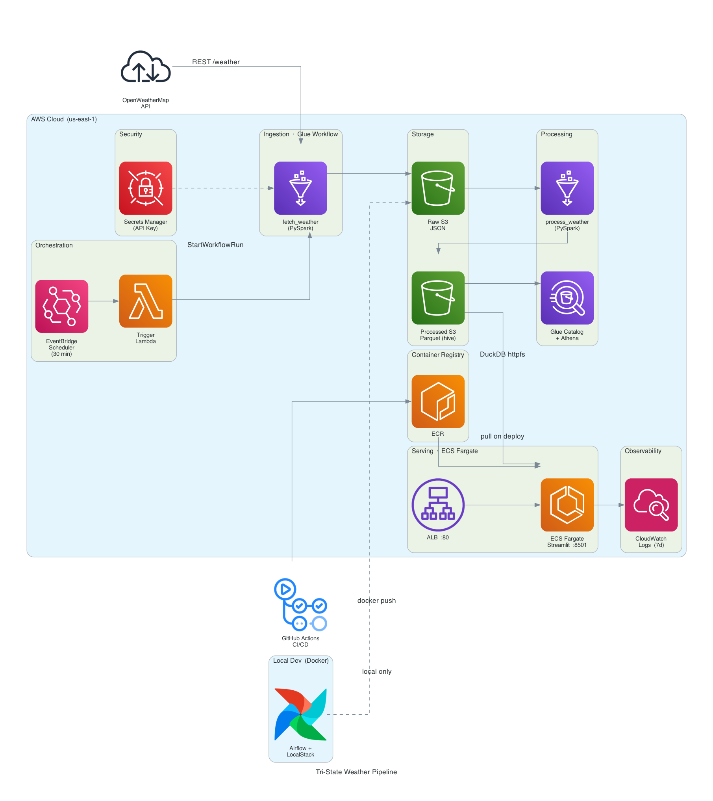
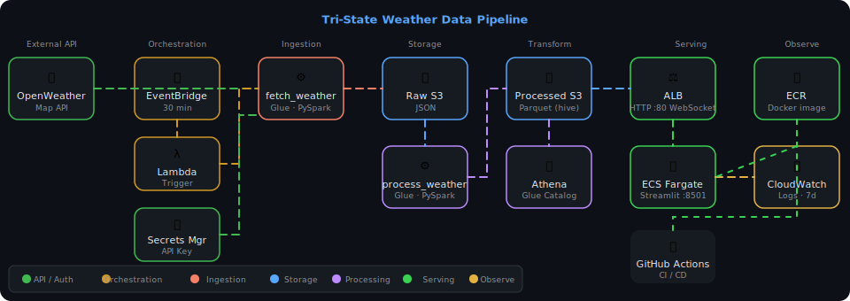

# Tri-State Weather Data Pipeline

---

## Dashboard Highlights

Live weather intelligence for **19 cities across New York, New Jersey, and Connecticut** — refreshed every 30 minutes, served from AWS.

### What you see

| Section | What it shows |
|---|---|
| **Weather Map** | Temperature-coloured scatter map; dot size scales with city population |
| **Current Conditions** | Per-city cards — temp, feels-like, humidity, wind, sky condition |
| **Regional Snapshot** | Max / min / avg KPIs across the tri-state region with hour-over-hour deltas |
| **Temperature Tracking** | Dual-line chart (actual + feels-like) for up to 3 cities over the past 24 h |
| **City Advisor** | Activity suggestions per city filtered by live weather severity (severe / poor / ok) — considers rain, snow, wind, humidity, and temperature |
| **Conditions Distribution** | Horizontal bar chart of sky-condition frequency across all cities |
| **City Comparison** | Box plot of 24 h temperature range (min / avg / max) per city |
| **Hourly Detail** | Full raw data table, filterable by city and time |

**Sidebar controls:** state filter, city multi-select, 24 h time slider with ▶ Play animation.

**Cities covered:**
New York City, Buffalo, Rochester, Yonkers, Syracuse, Albany, White Plains *(NY)* ·
Newark, Jersey City, Paterson, Elizabeth, Edison, Trenton *(NJ)* ·
Bridgeport, New Haven, Stamford, Hartford, Waterbury, Norwalk *(CT)*

---

## Architecture

<p align="center">
  
</p>

#### Data flow illustration: 
<p align="center">
  
</p>

**Local development** mirrors production using LocalStack (mock AWS) + Airflow.

---

## Tech Stack

| Layer | Local | Production |
|---|---|---|
| Orchestration | Apache Airflow (CeleryExecutor) | AWS EventBridge + Lambda |
| Ingestion | Python (direct) | AWS Glue (PySpark) |
| Storage | LocalStack S3 | AWS S3 |
| Transformation | DBT + DuckDB | DBT + AWS Athena |
| Secrets | LocalStack Secrets Manager | AWS Secrets Manager |
| Dashboard | Streamlit (localhost:8501) | Streamlit on ECS Fargate + ALB |
| Container Registry | — | AWS ECR |
| Infra-as-code | — | Terraform |
| CI/CD | — | GitHub Actions |

---

## Project Layout

```
├── app/
│   └── dashboard.py              # Streamlit dashboard (local + prod)
├── airflow/
│   └── dags/
│       └── weather_pipeline.py   # Airflow DAG (local dev)
├── dbt/                          # DBT models (staging → marts)
├── docker/
│   ├── airflow/Dockerfile
│   ├── streamlit/Dockerfile      # python:3.11-slim + streamlit/plotly/duckdb/boto3
│   └── superset/Dockerfile
├── scripts/
│   └── s3_to_duckdb.py           # Sync S3 processed data → local DuckDB
├── src/
│   ├── glue/
│   │   ├── fetch_weather.py      # Glue job: fetch from OpenWeatherMap
│   │   └── process_weather.py    # Glue job: validate + enrich raw JSON → Parquet
│   └── lambda/
│       └── trigger_pipeline.py   # Lambda: start Glue workflow
├── terraform/
│   ├── modules/
│   │   ├── ecs/                  # ECS Fargate + ALB + ECR + IAM
│   │   ├── athena/
│   │   ├── glue/
│   │   ├── iam/
│   │   ├── s3/
│   │   └── scheduler/            # EventBridge + Lambda trigger
│   └── environments/
│       ├── dev/
│       └── prod/
├── tests/
│   ├── unit/
│   ├── integration/              # Requires LocalStack
│   └── data_quality/
├── .github/workflows/
│   ├── ci.yml                    # Lint + test on every PR
│   └── cd.yml                    # Deploy dev → prod on merge to main
└── docker-compose.yml            # Full local dev stack
```

---

## Local Development

### Prerequisites

- Docker + Docker Compose
- Python 3.11
- An [OpenWeatherMap API key](https://openweathermap.org/api) (free tier)

### Setup

```bash
# 1. Clone
git clone https://github.com/your-org/weather_api_datapipeline.git
cd weather_api_datapipeline

# 2. Add your API key
cp .env.example .env
# Edit .env → OPENWEATHERMAP_API_KEY=your_key_here

# 3. Install Python deps (for local tooling)
python3.11 -m venv .venv && source .venv/bin/activate
pip install -r requirements.txt -r requirements-dev.txt

# 4. Start the full stack
make up
```

Starts Airflow, LocalStack, Superset, and Streamlit. LocalStack is auto-bootstrapped with S3 buckets and Secrets Manager.

### Local service URLs

| Service | URL | Credentials |
|---|---|---|
| Airflow UI | http://localhost:8080 | admin / admin |
| Streamlit | http://localhost:8501 | — |
| Superset | http://localhost:8088 | admin / admin |
| LocalStack | http://localhost:4566 | — |
| Flower (Celery) | http://localhost:5555 | — |

### Running the pipeline locally

```bash
# Trigger via Airflow UI → DAGs → weather_pipeline → ▶ Trigger
# Then sync S3 data into the local DuckDB file:
make refresh-db

# Dashboard auto-reloads every 5 min, or hit "Refresh Data" in the sidebar
```

### Stopping

```bash
make down               # stop everything
make down-scheduler     # stop Airflow scheduler/worker only (keep LocalStack + Streamlit)
```

---

## Testing

```bash
make test              # unit + integration + data quality
make test-unit         # fast, no external deps
make test-integration  # requires LocalStack running (make up first)
make test-dbt          # DBT schema + data tests
```

---

## Code Quality

```bash
make lint        # Ruff
make format      # Black + Ruff autofix
make type-check  # MyPy
make pre-commit  # all hooks
```

---

## DBT

```bash
make dbt-run          # run all models (local DuckDB)
make dbt-test         # schema + data quality tests
make dbt-docs         # serve docs at http://localhost:8081
make dbt-run-prod     # run against production Athena
```

---

## Deploying to AWS

### Prerequisites

- Terraform >= 1.6
- AWS CLI with sufficient permissions
- S3 bucket `weatherdata-terraform-state` (remote state backend)

### Infrastructure per environment

| Resource | Dev | Prod |
|---|---|---|
| S3 buckets (raw, processed, athena-results) | ✅ | ✅ |
| Glue jobs (fetch + process) | ✅ | ✅ |
| EventBridge scheduler (30 min) | ✅ (disableable) | ✅ |
| Lambda trigger | ✅ | ✅ |
| Athena workgroup + database | ✅ | ✅ |
| Secrets Manager (API key) | ✅ | ✅ |
| ECR repository | — | ✅ |
| ECS Fargate cluster + service | — | ✅ |
| Application Load Balancer | — | ✅ |

### Cost saving — disable dev scheduling when prod is live

```bash
make disable-dev-scheduling   # stop Glue runs in dev AWS environment
make enable-dev-scheduling    # re-enable
```

---

## CI/CD (GitHub Actions)

### On every PR → `ci.yml`

1. Lint — Ruff + Black + MyPy
2. Unit tests
3. Integration tests (moto)
4. Data quality tests
5. Terraform validate (dev + prod)

### On merge to `main` → `cd.yml`

```
CI gate (all tests pass)
    │
    ▼
Deploy → dev  (automatic)
    │  terraform apply + upload Glue scripts to S3
    │
    ▼
Smoke tests → dev
    │
    ▼
Deploy → prod  ← manual approval (GitHub Environment)
    │  1. Destroy old App Runner resources (migration, idempotent)
    │  2. terraform apply -target ECR   (create repo first)
    │  3. docker build + push to ECR
    │  4. terraform apply (full)        (ECS picks up new image)
    │  5. ecs wait services-stable      (ALB health check passes)
    │  6. upload Glue scripts to S3
    ▼
✅ Dashboard live at ALB URL
```

### Required GitHub Secrets

| Secret | Description |
|---|---|
| `AWS_DEPLOY_ROLE_DEV` | OIDC IAM role ARN for dev deployments |
| `AWS_DEPLOY_ROLE_PROD` | OIDC IAM role ARN for prod deployments |

Prod deployments require a reviewer in the **prod** GitHub Environment settings.

---

## Engineering Deep Dive

### Cost Optimization

| Lever | Detail | Savings |
|---|---|---|
| S3 Lifecycle Rules | Raw JSON → S3-IA after 30 d, Glacier after 90 d | ~60–70% on archival data |
| Athena Partition Pruning | Hive `year/month/day/hour` layout; a 24 h query scans 1/365 of annual data | Proportional to query selectivity |
| ECS Fargate Spot | Switch `FARGATE` → `FARGATE_SPOT` in task definition | ~70% compute cost |
| EventBridge Cadence | 30 min → 1 h halves Glue DPU invocations with minimal staleness impact | ~50% Glue cost |
| DuckDB Direct Reads | Dashboard reads Parquet from S3 via `httpfs` — no Redshift, RDS, or ElasticSearch | Eliminates $50–200/month DB tier |
| Dev Schedule Disable | `make disable-dev-scheduling` pauses EventBridge in dev env when prod is live | ~$40/month (dev Glue runs) |

### Scalability Paths

- **10× frequency (near-real-time):** Replace EventBridge poll → Kinesis Data Streams; Lambda consumes stream → triggers Glue micro-batch or writes directly to Firehose → S3.
- **Multi-region / global cities:** Extend city list to any OWM-supported location; Glue Catalog federation across regions; partitioned by `region=` prefix.
- **Snowflake migration:** Snowpipe auto-ingest on S3 `ObjectCreated` events; swap Athena for Snowflake SQL; DBT profiles unchanged (DuckDB → Snowflake connector).
- **Dashboard scale-out:** ECS Service Auto Scaling (target-tracking on ALB `RequestCountPerTarget`); add ElastiCache for DuckDB query result caching.
- **Real-time push:** OpenWeatherMap Enterprise WebSocket push → Kinesis Firehose → S3 → Lambda trigger (eliminates polling latency entirely).

### Failure Handling

| Failure Point | Mitigation |
|---|---|
| EventBridge → Lambda miss | SQS DLQ on EventBridge rule; missed triggers accumulate for manual replay without data loss |
| Glue job error | `--number-of-retries 2`; CloudWatch alarm on `glue.driver.aggregate.numFailedTasks > 0` → SNS |
| Bad raw data from OWM | Schema validation before processing; failed records quarantined to `s3://.../quarantine/` |
| `process_weather` re-run | Idempotent — overwrites same hive partition; no duplicates regardless of how many times it runs |
| ECS task crash | ALB health check (`/_stcore/health` × 3 failures) → ECS replaces task; CloudWatch logs capture last output |
| S3 read failure in dashboard | `@st.cache_data(ttl=300)` serves stale data for up to 5 min; UI shows last-updated timestamp |
| Terraform state conflict | Remote state in S3 + DynamoDB locking; CD `concurrency: cancel-in-progress: false` prevents concurrent applies |

### Why ECS Fargate + ALB over App Runner?

App Runner's ingress layer strips the HTTP `Upgrade: websocket` header — Streamlit's `_stcore/stream` WebSocket handshake fails silently (server returns HTML instead of `101 Switching Protocols`). ALB natively forwards WebSocket upgrades (RFC 6455), supports `lb_cookie` sticky sessions to pin each browser to the same ECS task, and allows `idle_timeout = 3600` to keep long-lived connections alive. At single-instance scale the cost is comparable (~$25/month ALB + Fargate vs ~$30/month App Runner for equivalent memory).

---

## Environment Variables

Copy `.env.example` to `.env`:

```bash
OPENWEATHERMAP_API_KEY=   # required
ENVIRONMENT=local         # local | dev | prod

# S3 (auto-suffixed by environment)
S3_RAW_BUCKET=weatherdata-raw-local
S3_PROCESSED_BUCKET=weatherdata-processed-local

# Airflow
AIRFLOW__CORE__FERNET_KEY=   # python -c "from cryptography.fernet import Fernet; print(Fernet.generate_key().decode())"
```
